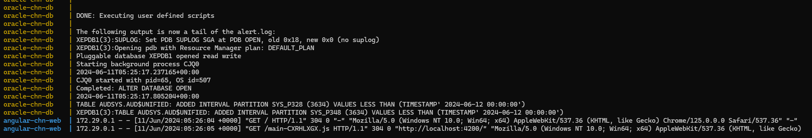

# chn-prueba-tecnica
Prueba tecnica chn

#comando para ejecutar solucion 
docker-compose up --no-deps --build --force-recreate

#para iniciar a probar la solucion  se debe esperar a que el contenedor de base de datos 
#finalice de inicializar el motor y de crear las tablas del esquema
Completed: ALTER DATABASE OPEN

#para acceder a la aplicacion we se accede por el puerto 4200
http://localhost:4200